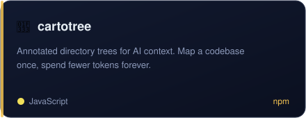
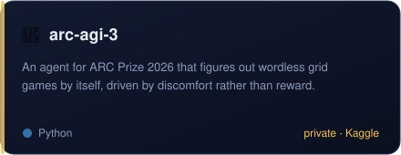
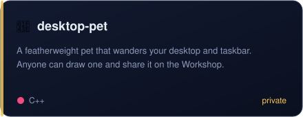
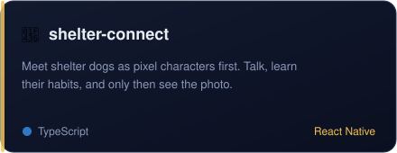
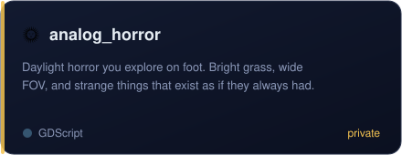
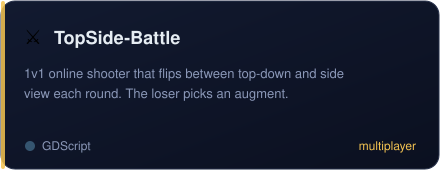
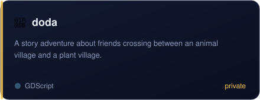

  
  

### 🛠 Tools

 

### 🗺 In between

 

### 🎮 Games

 

### 🧭 Along the way

- **Real-Thon Hackathon** — 1st place, team Globuddy 2025.08
- **9th UMC Hackathon** — 1st place 2025.11
- **KMIMIC Nursing Datathon** — 2nd place 2026.01
- UMC Web 9th · goormthon UNIV 4th · Growthon · US:code Hackathon
